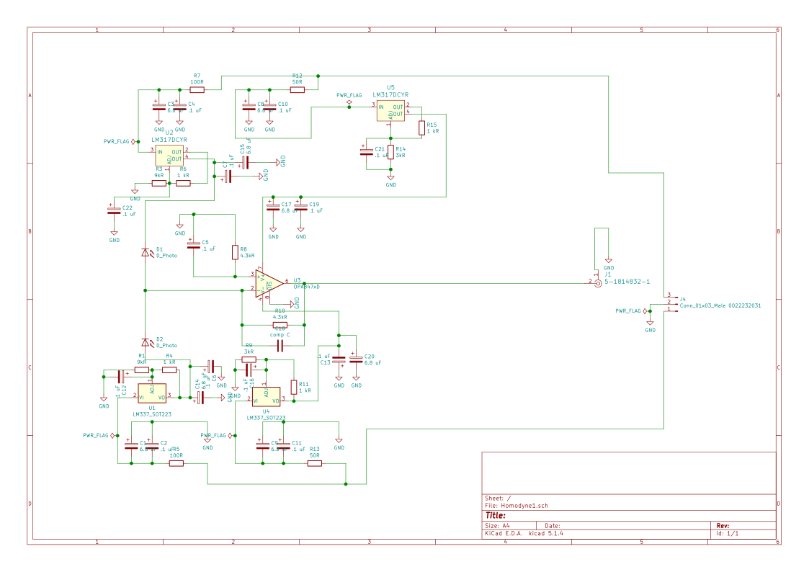

# Optical Homodyne detector
The design is done with Kicad 6.0 and is based on the [Optics Communications, 285(24), 5259-5267](https://www.sciencedirect.com/science/article/abs/pii/S0030401812008255).
## Few details
- The detector is designed for [First Sensor PS1.0-6B Photodetectors](https://www.mouser.ca/datasheet/2/313/PS1.0-6b_TO_501429-586466.pdf) photodiodes, but may also work with [Hamamatsu S5972](https://www.hamamatsu.com/eu/en/product/type/S5972/index.html).
- The detector is power by ± 15 Volts that are spitted on 4 Voltage variable regulators LM337 and LM317. 
- Two regulators are used to power the 4.7 kOhm transimpedance that is based on OPA 847 with effective bandwidth 3 dB of 100 MHz
- Two reversely biased photodiodes are separately biased my other two voltage regulators.
- Compensation capacitor C18 is used to prevent oscillations of the OPA847 and is in situ adjusted within a range of 1-4pF.

